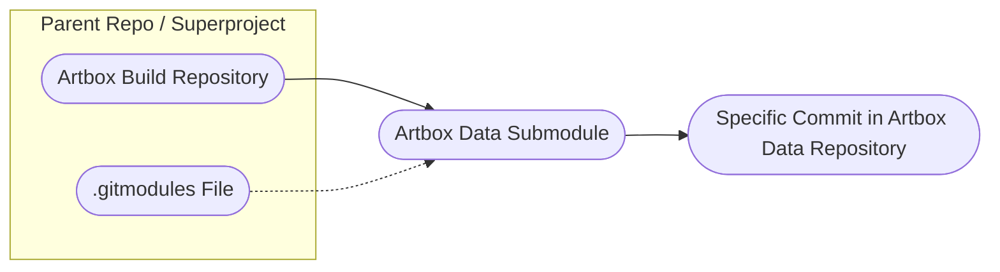

### Introduction

This guide explains how to manage the 'gimp-data' submodule within the Artbox project. A submodule is a repository embedded within another repository. It is _not_ a simple nested folder but a distinct repository with its own version control. The parent project is sometimes referred to as a superproject.

- **Artbox Repository**: The parent project, it references a commit in gimp-data.
  - **gimp-data**: The submodule that points to a different repository.

### Understanding the Submodule

- **Artbox Build Repository**: This is the [parent repository](https://gitlab.gnome.org/pixelmixer/artbox) that contains the 'gimp-data' submodule.
- **Artbox Data Submodule**: The directory within the Artbox repository that links to the [Artbox data repository](https://gitlab.gnome.org/pixelmixer/artbox-data).
- **Specific Commit in Artbox Data**: The submodule is fixed to a specific commit in the Artbox data repository.
- **.gitmodules File**: This file in the parent repository specifies the submodule's repository location.


_Diagram 1: This diagram illustrates the relationship between the Artbox build repository (superproject), the gimp-data submodule, and its specific commit. The .gitmodules file specifies the submodule details._

### Customizing the Submodule

- Configuration: You can configure the submodule to point to a different repository, such as a modified clone of gimp-data.
- Updating the Superproject: After pushing changes to the new repository, update the parent repository to point to the new commit.

#### Remotes

Ensure the submodule remotes are correctly set up. For example:
```sh
git remote -v
gimp-data-origin https://gitlab.gnome.org/GNOME/gimp-data.git (fetch)
gimp-data-origin https://gitlab.gnome.org/GNOME/gimp-data.git (push)
origin git@ssh.gitlab.gnome.org:pixelmixer/artbox-data.git (fetch)
origin git@ssh.gitlab.gnome.org:pixelmixer/artbox-data.git (push)
```

This set up has the GIMP gimp-data as an upstream remote called gimp-data-origin, this is used to fetch updates from GIMP.

The .gitmodules file in the parent repo should be adjusted to point at the Artbox gimp-data repo:

``` 
[submodule "gimp-data"]
	path = gimp-data
	url = https://gitlab.gnome.org/pixelmixer/artbox-data.git
	shallow = true
```
_The contents of the .gitmodules file in the build/artbox folder._


### Artbox Data

The Artbox 'gimp-data' repository is a clone of the original 'gimp-data' repository, with merged changes specifically for Artbox. Regularly rebasing to the upstream 'gimp-data' repository ensures that you incorporate the latest GIMP updates. Follow these steps to rebase:

1. **Checkout the 'convert-to-artbox' Branch**: Switch to the branch that integrates the latest changes and serves as the base for your updates.
    ```sh
    git checkout convert-to-artbox
    ```

2. **Update the Submodule**: Make sure the submodule is synchronized with the latest commit in the 'gimp-data' repository.
    ```sh
    git submodule update
    ```

3. **Checkout the 'main' Branch in the 'gimp-data' Directory**: Navigate to the 'gimp-data' submodule and switch to its main branch.
    ```sh
    cd gimp-data
    git checkout main
    ```

4. **Fetch the Latest Changes from the Original 'gimp-data' Repository**: Retrieve updates from the upstream repository to keep your local copy current.
    ```sh
    git fetch gimp-data-origin
    ```

5. **Rebase the Artbox Data Repository onto the Original 'gimp-data'**: Apply the latest changes from the upstream repository onto your local branch.
    ```sh
    git rebase gimp-data-origin/main
    ```

6. **Resolve Conflicts and Push Updates to the Artbox Data Repository**: If there are conflicts, resolve them, and then push the rebased changes to the Artbox data repository.
    ```sh
    git push -f
    ```

*Explanation*: By rebasing the Artbox 'gimp-data' repository onto the original 'gimp-data', you ensure that your project benefits from the latest updates and improvements. Regular rebasing helps avoid conflicts and keeps the repository in sync with upstream changes.


### Modifying or Adding New Resources

To change or add new resources in the 'gimp-data' submodule, follow these steps:

1. **Checkout the 'convert-to-artbox' Branch**: Ensure you are working on the correct branch that incorporates the latest changes.
    ```sh
    git checkout convert-to-artbox
    ```

2. **Update the Submodule**: Sync the submodule to ensure it is pointing to the latest commit in the 'gimp-data' repository.
    ```sh
    git submodule update
    ```

3. **Checkout the 'main' Branch in the 'gimp-data' Directory**: Switch to the main branch of the submodule where you will make changes.
    ```sh
    cd gimp-data
    git checkout main
    ```

4. **Make the Necessary Changes to the Data**: Edit or add files as needed within the 'gimp-data' submodule.

5. **Stage the Modified Files**: Add the changes to the staging area for the submodule.
    ```sh
    git add .
    ```

6. **Commit the Changes**: Commit the staged changes with a descriptive message.
    ```sh
    git commit -m "Describe your changes here"
    ```

7. **Push the Changes to the Artbox Data Repository**: Push the updates to the remote repository of the submodule.
    ```sh
    git push
    ```

8. **Update the Parent Repository**: Ensure the Artbox parent repository is updated to reflect the new commit in the 'gimp-data' submodule.
    ```sh
    cd ..
    git add gimp-data
    git commit -m "Update submodule to latest commit"
    git push
    ```

*Explanation*: This sequence ensures that changes are correctly made and integrated into both the submodule and the parent repository. By committing and pushing changes in the submodule first, and then updating the parent repository, you maintain proper synchronization and history.


### Propagating Changed Data to Feature Branches

To ensure that the changed data in the submodule is reflected in your feature branches, follow these steps:

1. **Checkout the Feature Branch**: Switch to the branch where you want to propagate the changes.

    ```sh
    git checkout feature-branch
    ```

2. **Rebase the Branch**: Rebase the feature branch onto the common base layer to incorporate the latest commit from the 'convert-to-artbox' branch. This step ensures that your feature branch is up-to-date with the latest changes.

    ```sh
    git rebase convert-to-artbox
    ```

3. **Update the Submodule**: After rebasing, update the submodule to ensure it points to the correct commit in the 'gimp-data' repository. This step integrates any changes made to the submodule.

    ```sh
    git submodule update --remote
    ```

4. **Push the Changes**: Push the updated feature branch to the remote repository, reflecting the integrated changes.

    ```sh
    git push
    ```

