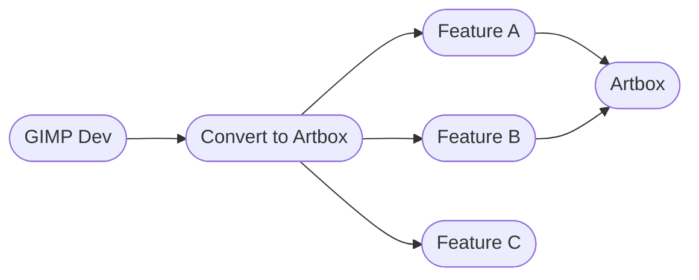

### Introduction

The diagram illustrates the flow of the development process. The GIMP development branch is the foundation, and the 'convert-to-artbox' branch serves as the common base for all feature branches. These feature branches contribute to the final 'Artbox' branch, which represents the integrated work from all features.

### Contents

- [Updating Artbox to GIMP Dev](#updating-artbox-to-gimp-dev)
   - [Step 1: Construct the Common Base](#step-1-construct-the-common-base)
   - [Step 2: Construct Feature Branches from the Common Base](#step-2-construct-feature-branches-from-the-common-base)
   - [Step 3: Construct Artbox from the Common Base and Feature Branches](#step-3-construct-artbox-from-the-common-base-and-feature-branches)
- [Convert Branches](#convert-branches)
   - [Example of a Compound Convert Branch: convert-paintbrush-all-merged](#example-of-a-compound-convert-branch-convert-paintbrush-all-merged)
- [Feature Branches](#feature-branches)
   - [Example of a Compound Feature Branch: feature-paintbrush-options](#example-of-a-compound-feature-branch-feature-paintbrush-options)
- [Notes](#notes)

Branch Development Flow for GIMP to Artbox
---

---
_Diagram 4: This diagram illustrates the flow from the GIMP Dev branch to the final Artbox branch. The 'convert-to-artbox' branch is created from GIMP Dev, and it supports the development of multiple feature branches. Each feature branch, originates from the common 'convert-to-artbox' base branch. Finally, the individual feature branches merge into the 'artbox' branch_

### Updating Artbox to GIMP Dev

To keep Artbox up-to-date with the GIMP development branch, we follow a structured process divided into three main steps

#### Step 1: Construct the Common Base

- **Reset the Common Base:** Reset the 'convert-to-artbox' branch to the latest commit from the GIMP master branch.
- **Merge Convert Branches:** Merge all relevant convert branches into the 'convert-to-artbox' branch.
- **Squash Commit History:** Squash the commit history of these merges into a single commit to simplify history.

#### Step 2: Construct Feature Branches from the Common Base

- **Update the Common Base:** Ensure that the 'convert-to-artbox' branch is up to date with the latest changes.
- **Clone and Layer Commits:**
  - Clone the 'convert-to-artbox' branch.
  - Pick and apply commits from each existing feature branch onto this clone.
- **Replace Old Feature Branches:**
  - Delete the old feature branches.
  - Rename the cloned branches to replace the old feature branches.
- **Repeat for All Feature Branches:** Perform the above steps for each feature branch that needs updating.

#### Step 3: Construct Artbox from the Common Base and Feature Branches

- **Reset Artbox Branch:** Reset the 'artbox' branch to the 'convert-to-artbox' branch to incorporate the latest changes.
- **Merge Updated Feature Branches:** Merge all updated feature branches into the 'artbox' branch to consolidate the changes.

### Convert Branches

A convert branch is used to adjust the latest GIMP master branch to support the Artbox feature branches or to make specific changes to the default GIMP application. These branches are merged into a single 'convert-to-artbox' branch, which serves as the common base layer.

The current strategy is to place any heavily modified file that supports multiple feature branches—through the addition of new data structures—into a convert branch. This approach helps consolidate overlapping changes in one place, while maintaining the core code that performs the main functions in separate feature branches.

The convert branches are:

- **convert-to-artbox:** The main branch that combines all other convert branches.
  - **convert-data-remote:** Handles the gimp-data remote url.
  - **convert-context-all-merged:** Consolidates context-related changes.
  - **convert-paintbrush-all-merged:** Integrates modifications to the paintbrush tool.
  - **convert-pref-all-merged:** Merges changes to preferences.
  - **convert-force-artbox-config:** Forces specific configuration settings for Artbox.
  - **convert-name:** Manages naming of Artbox.
  - **convert-readme:** Updates the README.md

### Updating Artbox: Identifying Conflicts

The first stage of updating Artbox to the GIMP development branch involves identifying any conflicts or changes introduced by GIMP that overlap with Artbox changes. These conflicts can then be resolved at this early stage.


#### Example of a Compound Convert Branch: convert-paintbrush-all-merged

A convert branch like 'convert-paintbrush-all-merged' is itself a combined branch that integrates multiple smaller changes.

- convert-paintbrush-all-merged: Integrates modifications to the paintbrush tool.
  - convert-paintbrush-simple-boundary
  - convert-paintbrush-simple-boundary
  - convert-paintbrush-status-alt
  - convert-paintbrush-erase
  - convert-paintbrush-has-alpha
  - convert-paintbrush-has-alpha
  - convert-paintbrush-erasing-paint
  - convert-paintbrush-erasing-paint

These sub-branches implement smaller, specific changes. If a conflict arises between convert-paintbrush-all-merged and the GIMP development branch, the sub-branch can be reset to align with the latest GIMP development version, and the minor adjustment can be reapplied as needed.

### Feature Branches

A feature branch may also serve as an integration branch to consolidate multiple related changes. For example, the branch feature-paintbrush-options is composed of several smaller branches that have been merged together. This approach allows conflicts to be resolved incrementally, reducing complexity during the final merge into the main branch.

#### Example of a Compound Feature Branch: feature-paintbrush-options

- feature-paintbrush-options
  - options-paintbrush-order
  - options-paintbrush-separate-dynamics
  - options-paintbrush-compact-resource-view
  - options-paintbrush-remove-link-brush
  - options-paintbrush-remove-reset-brush
  - options-paintbrush-additional-expander
  - convert-to-artbox
  
These merged sub-branches appear as individual commits in the feature-paintbrush-options branch commit history, after the commit labeled "convert to artbox."

```
git checkout feature-paintbrush-options
git log

commit <SHA> (HEAD -> feature-paintbrush-options)
    Merge branch 'options-paintbrush-order'

commit <SHA>
    Merge branch 'options-paintbrush-separate-dynamics'

commit <SHA>
    Merge branch 'options-paintbrush-compact-resource-view'

commit <SHA>
    Merge branch 'options-paintbrush-remove-link-brush'

commit <SHA>
    Merge branch 'options-paintbrush-remove-reset-brush'

commit <SHA>
    Merge branch 'options-paintbrush-additional-expander'

commit <SHA>
    convert to artbox

```

### Notes

The key difference between a feature branch and a convert branch is that feature branches, and their sub-branches, build on top of the convert-to-artbox branch. In contrast, a convert branch is an adjustment made directly to the GIMP development master branch.
