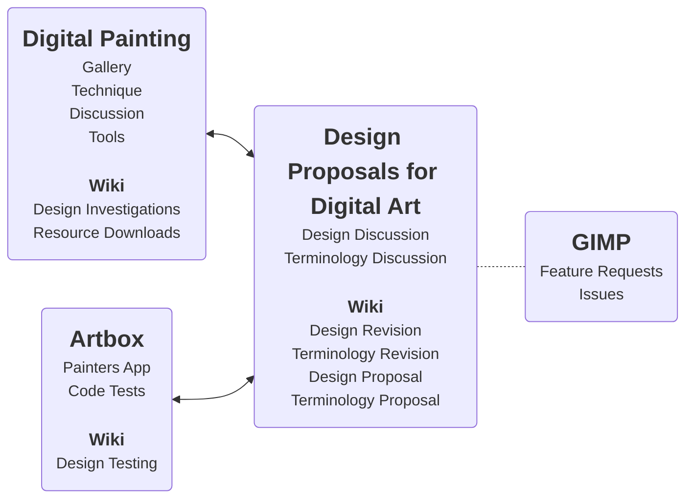

Artbox is a digital painting and illustration application for [Linux](https://gitlab.gnome.org/pixelmixer/artbox/-/wikis/A-Linux-System-Overview), specifically designed to cater to the needs of artists. It is an open-sourced, artist-adjusted version of GIMP, which allows for more flexibility and customization. The intention behind Artbox is to add new features and modify GUI interactions to make the application more fun and productive for artists. While GIMP is a powerful and versatile tool, its broad user base and design requirements can make it difficult to introduce significant changes. Artbox addresses this limitation by building on top of the GIMP codebase, adding new features that can do more than traditional plug-ins. However, managing these changes carefully is crucial to ensure that Artbox remains stable and compatible with the underlying GIMP codebase.

Artbox is powered by the [GNU Image Manipulation Program](https://www.gimp.org/) open source project.

## Artbox on a GitLab Repository Map

---
_The diagram illustrates the links between the Digital Painting, Artbox, and Design Proposals for Digital Art repositories, which are working on enhancing digital art tools and techniques. The Design Proposals for Digital Art repository plays a central role in this network, aiming to provide high-quality feature proposals to the GIMP team, through in-depth discussions and revisions. While Digital Painting focuses on community discussions, techniques, and resources, Artbox is dedicated to app development and practical testing._

### [Digital Painting](https://gitlab.gnome.org/americo_gobbo/digital-painting/-/wikis/home)

### [Design Proposals for Digital Art](https://gitlab.gnome.org/americo_gobbo/GIMPBrushwork/-/wikis/home)

